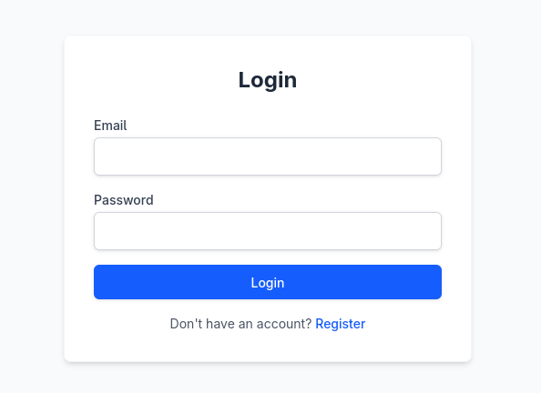
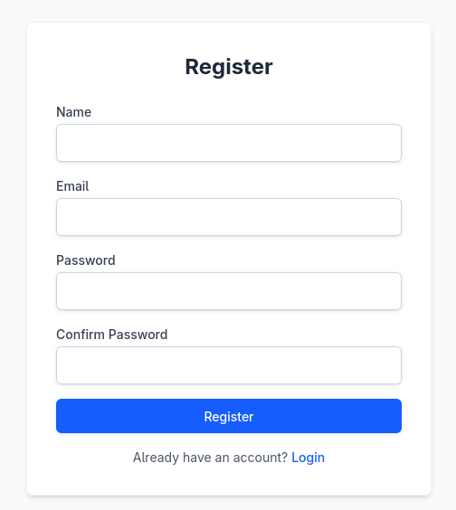
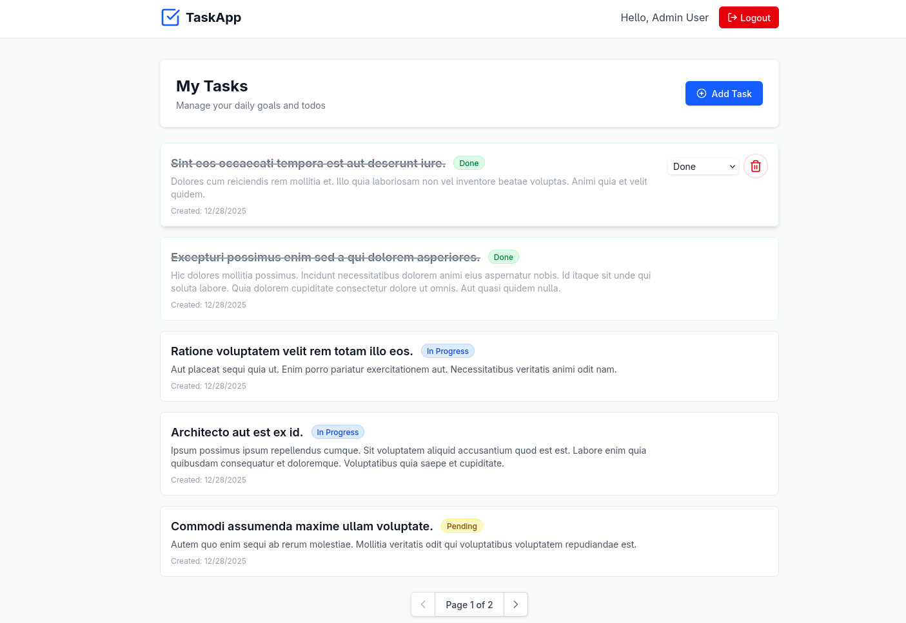
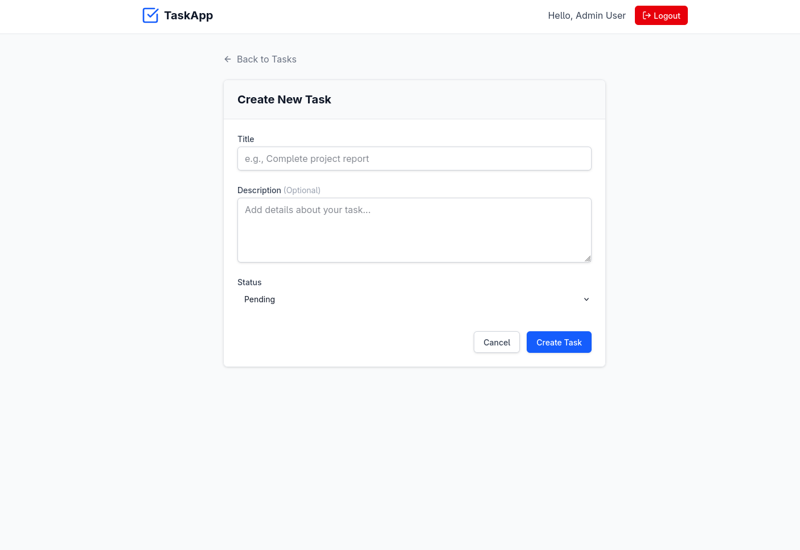
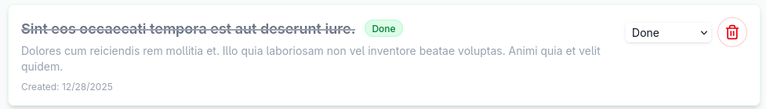

# Task Management App

A full-stack task management application built with **Laravel 11** (backend) and **React + TypeScript** (frontend).

## 🚀 Features

- **Secure Authentication**: Uses **HttpOnly Cookies** (JWT) for secure, XSS-resistant authentication.
- **Task Management**: Create, Read, Update, and Delete (CRUD) tasks.
- **Status Tracking**: Mark tasks as Pending, In Progress, or Done.
- **Responsive UI**: Modern interface with instant feedback and error handling.
- **Dockerized**: Fully containerized for easy deployment.

---

## 🛠️ Deployment (Docker)

The easiest way to run the project is using Docker. This ensures environment consistency.

### Prerequisites

- Docker & Docker Compose installed on your machine.

### Steps to Run

1.  **Clone the repository**:

    ```bash
    git clone <repository_url>
    cd <project_directory>
    ```

2.  **Environment Setup**:

    - Navigate to `backend/` and create `.env` from example:
      ```bash
      cd backend
      cp .env.example .env
      ```
    - Update `.env` database credentials to match `docker-compose.yml`:
      ```ini
      DB_CONNECTION=mysql
      DB_HOST=db
      DB_PORT=3306
      DB_DATABASE=app_db
      DB_USERNAME=app_user
      DB_PASSWORD=password
      ```

3.  **Start Containers**:

    - From the project root:
      ```bash
      docker-compose up -d --build
      ```

4.  **Finalize Backend**:

    - Run migrations and seeds inside the container:
      ```bash
      docker-compose exec app php artisan migrate --seed
      docker-compose exec app php artisan key:generate
      docker-compose exec app php artisan jwt:secret
      ```

5.  **Access the App**:
    - **Frontend**: http://localhost:5173
    - **Backend API**: http://localhost:8000

---

## 🛠️ Local Development (Manual)

If you prefer running without Docker:

### Backend (Laravel)

1.  `cd backend`
2.  `composer install`
3.  `cp .env.example .env` (Configure DB settings)
4.  `php artisan key:generate`
5.  `php artisan jwt:secret`
6.  `php artisan migrate --seed`
7.  `php artisan serve` (Runs on `http://localhost:8000`)

### Frontend (React)

1.  `cd frontend`
2.  `npm install`
3.  `npm run dev` (Runs on `http://localhost:5173`)

---

## 🧪 Test Credentials

The database seeder creates two users for you to test with:

| User Role        | Email               | Password   |
| :--------------- | :------------------ | :--------- |
| **Admin**        | `admin@rawmart.com` | `password` |
| **Regular User** | `user@rawmart.com`  | `password` |

---

## 📡 API Endpoints

| Method     | Endpoint          | Description                         | Auth Required |
| :--------- | :---------------- | :---------------------------------- | :------------ |
| **POST**   | `/api/register`   | Register a new user                 | No            |
| **POST**   | `/api/login`      | Login and receive HttpOnly cookie   | No            |
| **POST**   | `/api/logout`     | Logout and clear cookie             | Yes           |
| **POST**   | `/api/refresh`    | Refresh session / Check auth status | Yes (Cookie)  |
| **GET**    | `/api/tasks`      | Get all tasks (paginated)           | Yes           |
| **POST**   | `/api/tasks`      | Create a new task                   | Yes           |
| **GET**    | `/api/tasks/{id}` | Get a specific task                 | Yes           |
| **PUT**    | `/api/tasks/{id}` | Update a task                       | Yes           |
| **DELETE** | `/api/tasks/{id}` | Delete a task                       | Yes           |

---

## 📸 Screenshots

| Page                 | Screenshot                                 |
| :------------------- | :----------------------------------------- |
| **Login Page**       |        |
| **Register Page**    |  |
| **Dashboard (Home)** |     |
| **Create Task**      |      |
| **Task Card**        |       |

---

## 📌 Assumptions & Configuration

1.  **HttpOnly Cookies**: The authentication relies entirely on HttpOnly cookies. This means:
    - The backend (`localhost:8000`) and frontend (`localhost:5173`) must enable credentials (`withCredentials: true`).
    - **CORS** is strictly configured to allow `http://localhost:5173` only.
    - You cannot test authenticated endpoints easily with Postman unless you manually manage the cookie jar.
2.  **Environment**: The setup assumes a local development environment. For production, `SANCTUM_STATEFUL_DOMAINS` and `SESSION_DOMAIN` would need configuration.
3.  **Database**: Default configuration assumes SQLite or a properly configured MySQL server as per `.env`.
